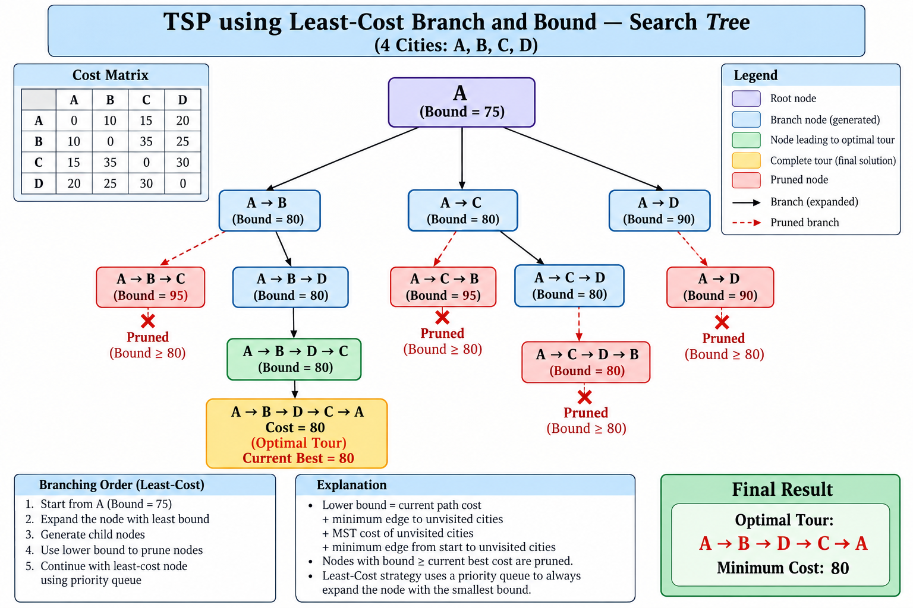

# Project 14: Traveling Salesperson Problem using Branch and Bound

## Description

This project demonstrates the solution of the Traveling Salesperson Problem (TSP) using the **Least-Cost Branch and Bound** technique.

The objective of TSP is to find the minimum-cost tour that visits every city exactly once and returns to the starting city.

In this project, four cities — A, B, C, and D — are considered. The Branch and Bound technique explores possible tours while using lower bounds to eliminate branches that cannot produce a better solution.

---

## Problem Statement

Given the following cost matrix, find the minimum-cost tour starting from city A, visiting every city exactly once, and returning to city A.

|     | A  | B  | C  | D  |
|-----|----|----|----|----|
| A   | 0  | 10 | 15 | 20 |
| B   | 10 | 0  | 35 | 25 |
| C   | 15 | 35 | 0  | 30 |
| D   | 20 | 25 | 30 | 0  |

---

## Algorithm

### Least-Cost Branch and Bound

1. Start with city A as the root node.
2. Calculate the initial lower bound.
3. Generate branches by selecting unvisited cities.
4. Calculate the lower bound for every generated branch.
5. Store the branches according to their lower-bound values.
6. Select the branch having the least lower bound.
7. Continue expanding the least-cost branch.
8. When a complete tour is obtained, calculate its total cost.
9. Update the best cost if the new tour has a lower cost.
10. Prune a branch when its lower bound is greater than or equal to the current best cost.
11. Continue until all promising branches have been processed.
12. The tour with the minimum cost is the optimal solution.

---

## Pseudocode

```text
TSP_Branch_And_Bound()

    Start from city A

    Calculate initial lower bound

    Insert root node into priority queue

    bestCost = infinity
    bestPath = empty

    while priority queue is not empty:

        Select the node with the least lower bound

        if node.bound >= bestCost:
            prune the node
            continue

        if all cities are visited:

            Calculate complete tour cost

            if tour cost < bestCost:
                bestCost = tour cost
                bestPath = current path

            continue

        for each unvisited city:

            Create a new branch

            Calculate its lower bound

            Add the branch to the priority queue

    return bestPath and bestCost
```

---

## Branching Process

The initial lower bound obtained is:

```text
Initial Lower Bound = 75
```

The first branches generated are:

```text
A -> B    Bound = 80
A -> C    Bound = 80
A -> D    Bound = 90
```

The least-cost branches are explored first.

Further branches include:

```text
A -> B -> C       Bound = 95
A -> B -> D       Bound = 80

A -> C -> B       Bound = 95
A -> C -> D       Bound = 80
```

The promising branch:

```text
A -> B -> D -> C
```

leads to the complete tour:

```text
A -> B -> D -> C -> A
```

with total cost:

```text
80
```

Therefore, the current best cost becomes:

```text
Best Cost = 80
```

---

## Bounding and Pruning

Branch and Bound uses lower bounds to determine whether a branch should be explored further.

After finding a complete tour with cost 80, branches whose lower bound is greater than or equal to the current best cost are pruned.

The following branches are pruned:

```text
A -> C -> D -> B    Bound = 80
A -> D              Bound = 90
A -> B -> C         Bound = 95
A -> C -> B         Bound = 95
```

These branches are not explored further because their lower bounds cannot produce a solution better than the current best cost of 80.

---

## Visualization

The following search-tree visualization shows the Branch and Bound process, including branching, lower bounds, pruning, and the optimal solution.



### Optimal Tour

**A → B → D → C → A**

### Minimum Cost

**80**

---

## Prompt Used

The visualization was generated using the following prompt:

> Create a professional DAA visualization for the Traveling Salesperson Problem (TSP) using Least-Cost Branch and Bound for 4 cities: A, B, C, and D.
>
> Use the given cost matrix and create a hierarchical search tree starting from city A.
>
> Show the branches, lower bounds, least-cost selection, optimal tour, and pruned branches. Clearly distinguish the optimal path and pruned nodes using visual indicators.
>
> Use a clean academic style suitable for a Design and Analysis of Algorithms project presentation.
>
> Title the visualization:
> "TSP using Least-Cost Branch and Bound — Search Tree"

The complete prompt is available in `Prompt.txt`.

---

## Output

The program produces the following final result:

```text
==============================================
             FINAL RESULT
==============================================

Optimal Tour: A -> B -> D -> C -> A
Minimum Cost: 80
```

### Final Result

**Optimal Tour:** A → B → D → C → A

**Minimum Cost:** 80

---

## Complexity

The Traveling Salesperson Problem has a factorial-sized search space. For `n` cities, the number of possible tours grows approximately as:

```text
(n - 1)!
```

Branch and Bound reduces the number of branches explored by using lower bounds and pruning non-promising branches.

However, the worst-case time complexity remains exponential/factorial.

---

## Learning Outcome

Through this project, we learned:

- The concept of the Traveling Salesperson Problem.
- The Branch and Bound technique.
- Least-Cost Branch and Bound.
- Calculation and use of lower bounds.
- Branching of possible solutions.
- Pruning of non-promising branches.
- Finding an optimal solution using Branch and Bound.
- Visualizing the Branch and Bound search tree.
- Implementing and documenting an algorithm using Python and GitHub.

---

## Files

```text
Project14_TSP_BnB.py    - Python implementation
Prompt.txt              - Prompt used for visualization
Visualization.png       - Branch and Bound search tree
README.md               - Project documentation
```